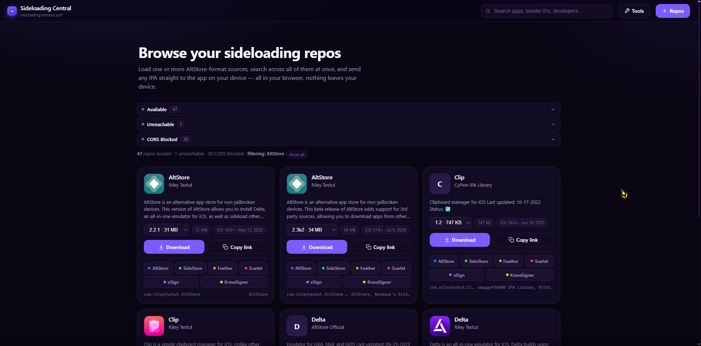
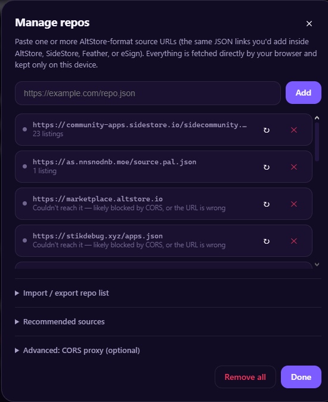
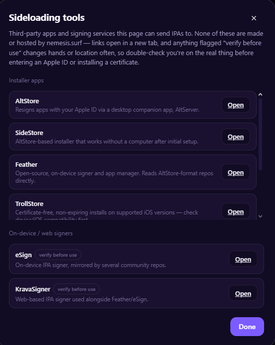

<p align="center">
  
</p>

<h1 align="center">KNOW ISSUE</h1>
mobile styling for app listing is bugged  
this is being debugged  

<h1 align="center">Sideloading Central</h1>

<p align="center">
  A fully client-side browser for iOS sideloading repos. No backend, no build step, no data leaves your device.
  <br />
  <a href="https://sideloading.nemesis.surf"><strong>sideloading.nemesis.surf</strong></a>
</p>

---

Sideloading Central loads AltStore-format repo JSON straight in your browser, merges duplicate app listings across versions and repos, and lets you download, copy, or send any IPA straight into AltStore, SideStore, Feather, Scarlet, eSign, or KravaSigner — all without a server in between.

## Screenshots

<p align="center">
  
</p>

<p align="center">
  
  
</p>

## Features

- **Multi-repo loading** — add as many AltStore-format source URLs as you want; they all fetch in parallel.
- **Smart de-duplication** — apps listed more than once, whether through a proper `versions` array or as repeated flat entries (some repos do this), are merged into a single card grouped by `bundleIdentifier`, versions sorted newest-first.
- **Live search** — filters by name, developer, bundle ID, and subtitle across every loaded repo at once.
- **Direct download & copy link** — grab the IPA straight from the source, or copy its URL to install elsewhere.
- **One-tap install** — per-app buttons open the app's install scheme directly: AltStore, SideStore, Feather, Scarlet, eSign, and KravaSigner out of the box, with room to add more.
- **Import / export repo lists** — paste a newline-separated list to bulk-add sources, or copy your current list out as plain text.
- **Recommended sources** — a curated set of official/open-source repos (emulators, VMs, dev tools) you can add in one tap, based on the community-maintained [awesome-altstore](https://github.com/victordedomenico/awesome-altstore) list.
- **Sideloading tools panel** — quick reference for where to get the installer apps and signers this page can hand IPAs off to.
- **100% client-side** — every repo fetch happens in your browser via `fetch()`; nothing is proxied or logged by this site. Repo lists and settings persist in `localStorage` only.
- **Apple-style UI, dark theme** — fully responsive, built to feel at home on iOS and macOS alike.

## How it works

1. Add one or more repo URLs (the same JSON links you'd paste into AltStore, SideStore, Feather, or eSign).
2. Your browser fetches each one directly. Apps are grouped and deduplicated locally.
3. Search, then pick a version if an app has more than one.
4. Download the IPA, copy its link, or tap an install button to hand it straight to the app of your choice.

Nothing here signs, hosts, or modifies any IPA — it's a browser for repos you already trust, pointing you at tools you already have.

## Running locally

Open `index.html` directly, or serve the folder over HTTP for best compatibility:

```bash
python3 -m http.server 8080
# then visit http://localhost:8080
```

## Deploying

No build step — deploy the folder as-is.

**GitHub Pages** — push this repo (or this folder, if nested inside a larger site repo) and point Settings → Pages at the branch/folder containing `index.html`.

**Cloudflare Pages** — connect the repo, leave the build command empty, set the output directory to this folder.

Asset paths are relative (`./style.css`, `./app.js`), so it works unmodified whether served from a domain root or a subpath.

## Two things worth knowing

**Install URL schemes.** `altstore://install?url=` and `sidestore://install?url=` are well-documented and stable. `feather://`, `scarlet://`, `esign://`, and `kravasigner://addRepo=` are provided as best-effort defaults — these apps update often and don't always publish their scheme, so if a button doesn't fire correctly, check the app's own docs and edit `DEFAULT_INSTALL_TARGETS` at the top of `app.js` (plain array, no build step). `state.customTargets` / `localStorage["ipagui.customInstallTargets"]` is already wired up if you want to expose adding custom targets from the UI.

**CORS.** Some repos don't send the headers browsers require for cross-origin `fetch()`, so a source can fail to load here even though the URL itself is fine. The Repos panel has an optional CORS proxy field for that — it's only ever used for the repo's *metadata JSON*; download links and install buttons always point straight at the original file.

## Contributing

Issues and PRs welcome — new default install targets, additional recommended sources, UI polish, whatever. Keep it dependency-free and client-side.

## Credits

- Recommended source list curated from [awesome-altstore](https://github.com/victordedomenico/awesome-altstore) by [@victordedomenico](https://github.com/victordedomenico).
- Built for the [nemesis.surf](https://nemesis.surf) community — Power To The Players.
